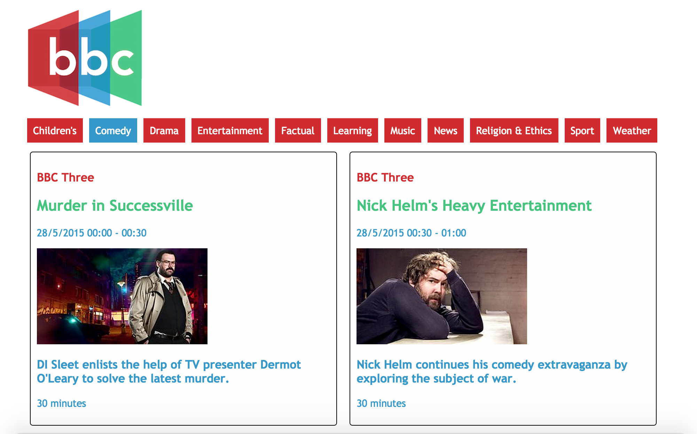

[](https://codeclimate.com/github/katebeavis/bbc-tv-guide)
# BBC TV Guide
BBC TV Guide lets users see the tv schedule across all channels for the next day. Users are able to see programmes sorted by genre and each programme displays it's channel, title, date and time, image, description and length.

It is written in Javascript and uses the BBC api to get the schedule information.

#Screenshots
<div align="center">
  
</div>

##Technology
- Javascript
- jQuery
- HTML & CSS
- BBC Api


##To Run
```
$ git clone https://github.com/katebeavis/bbc-tv-guide.git
$ cd bbc-tv-guide
open index.html
```
